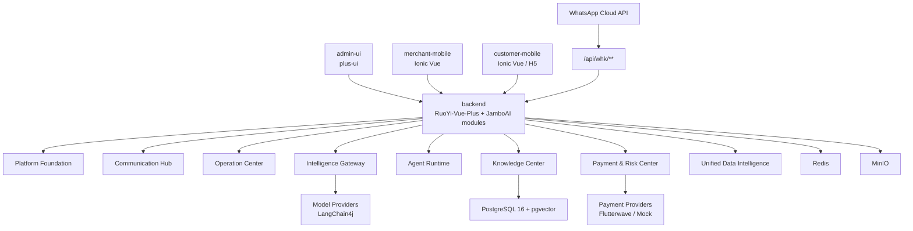

# JamboAI Overall Architecture

## Positioning

JamboAI is an AI-driven, fully managed WhatsApp and multi-channel commerce service platform for Africa and Southeast Asia. The platform serves four business levels: country tenants, city agents, merchants and end users.

The first product version must support two parallel customer entries:

- WhatsApp Business conversations owned by merchants.
- Independent customer App/H5 entry.

Merchant mobile is the priority client. Customer mobile is a parallel customer entry, not just a supplement to WhatsApp.

## Architecture Principles

- Reuse RuoYi-Vue-Plus for platform admin, tenant, user, role, menu, data permission, dictionary, parameter config, OSS, logs, monitoring and code generation.
- Keep all JamboAI business modules, package names, documents and frontend project names under `jamboai`. Do not use standalone `jambo`.
- Keep platform admin users in RuoYi `sys_user`, `sys_role`, `sys_menu` and `sys_dept`.
- Keep merchant staff in `biz_base_merchant_staff` and merchant RBAC tables. Do not mix merchant staff into `sys_user`.
- Keep end users in `biz_base_member` and connect each merchant relationship through `biz_base_merchant_member`.
- Use `tenant_id`, `agent_id`, `merchant_id`, `staff_id`, `member_id` and `channel_type` as the shared business context.
- Implement external integrations through adapters. Domain services must not depend directly on WhatsApp Cloud API, Flutterwave or a specific model provider.
- Use Spring Event first for asynchronous domain events. Keep event payloads stable so MQ can replace Spring Event later.
- AI must call business functions only through controlled tools. Agent code must not directly update business tables.
- All money changes must go through transactions and ledger records. Payment callbacks must be idempotent.

## Logical Layers

## Module Responsibilities

| Module | Responsibility |
| --- | --- |
| `jamboai-common-domain` | Shared enums, org scope, domain events and module contracts |
| `jamboai-platform-foundation` | Tenant extension, city agent, merchant, staff, member, merchant RBAC, app menus and i18n |
| `jamboai-communication-hub` | Channel accounts, WhatsApp phones, sessions, messages, handover and templates |
| `jamboai-intelligence-gateway` | Model providers, model routes, prompt templates, token logs and model call logs |
| `jamboai-agent-runtime` | Capabilities, tools, agent templates, merchant agent apps, tasks and tool logs |
| `jamboai-knowledge-center` | Documents, chunks, embeddings, FAQ and retrieval services |
| `jamboai-operation-center` | Goods, SKU, orders, services, schedules, entitlements, bookings and verification |
| `jamboai-payment-risk-center` | Payment channels, merchant payment accounts, transactions, callbacks, wallet, ledger, fees, commission, settlement, withdraw, reconciliation and risk |
| `jamboai-unified-data-intelligence` | Memory, feedback, metrics and behavior events |

## Multi-Channel Design

Every customer interaction must be represented as a channel-aware entry.

Recommended channel types:

| Type | Meaning |
| --- | --- |
| `whatsapp` | WhatsApp Business Cloud API |
| `customer_app` | Customer App |
| `customer_h5` | Customer H5 |
| `merchant_app` | Merchant App internal action |
| `admin_console` | Platform admin action |
| `api` | Open API or future partner API |

Channel provider configuration must support:

- `mock`: local development and automated testing.
- `sandbox`: provider sandbox or test mode.
- `production`: real provider environment.

WhatsApp configuration belongs to channel account and WhatsApp phone records. Provider secrets should be encrypted or stored through the platform secret policy, not hard-coded in YAML.

## Payment Design

Payment must be adapter-based from the first version.

Required provider modes:

- `mock`: generates local payment intents and deterministic callbacks.
- `sandbox`: Flutterwave test mode when available.
- `production`: real Flutterwave V3.

Order services create payment intents through the payment domain. They must not call Flutterwave directly. Payment callbacks update payment transactions first, then publish domain events to update order payment state.

## I18n Design

The first version supports 10 languages:

| Code | Language |
| --- | --- |
| `en` | English |
| `zh-CN` | Simplified Chinese |
| `ja` | Japanese |
| `ko` | Korean |
| `de` | German |
| `ru` | Russian |
| `fr` | French |
| `pt` | Portuguese |
| `es` | Spanish |
| `ar` | Arabic |

I18n sources:

- `dict_language` defines language metadata.
- `sys_menu_i18n` stores platform admin menu translations.
- `biz_base_app_menu_i18n` stores merchant and customer app menu translations.
- `cfg_i18n_message` stores system messages.
- Business tables may use JSONB fields such as `name_i18n` when the SQL schema provides them.

Arabic requires RTL layout support in frontend base components.

## Data Scope

| User type | Account table | Scope |
| --- | --- | --- |
| Platform operator | `sys_user` | Global or assigned tenant scope |
| Country tenant admin | `sys_user` | `tenant_id` |
| City agent admin | `sys_user` plus business relation | `tenant_id + agent_id` |
| Merchant staff | `biz_base_merchant_staff` | `tenant_id + agent_id + merchant_id + staff_id` |
| End user | `biz_base_member` | `member_id`, plus merchant relationship through `biz_base_merchant_member` |

Backend service methods must receive or resolve a JamboAI business context before accessing scoped tables.

## Development Rule

Do not generate CRUD for all 83 tables at once. Each phase must implement table groups only when they are needed by a working business flow.
