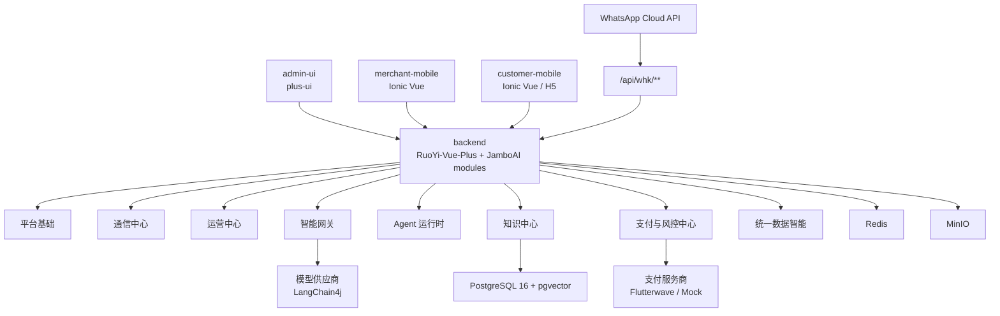

# JamboAI 整体架构

## 项目定位

JamboAI 是面向非洲和东南亚市场的 AI 驱动全托管 WhatsApp 与多渠道商业服务平台。系统服务国家租户、城市代理、商户和终端用户四层业务结构。

第一版产品必须支持两个并行的用户入口：

- 商户自有 WhatsApp Business 号码的会话入口。
- 独立用户端 App/H5 入口。

商户端是优先级最高的移动端。用户端是与 WhatsApp 并行的客户入口，不是 WhatsApp 的附属入口。

## 架构原则

- 复用 RuoYi-Vue-Plus 的平台后台、租户、用户、角色、菜单、数据权限、字典、参数配置、OSS、日志、监控和代码生成能力。
- 所有 JamboAI 业务模块、包名、文档和前端项目命名统一使用 `jamboai`，不要使用单独的 `jambo`。
- 平台后台账号使用 RuoYi `sys_user`、`sys_role`、`sys_menu`、`sys_dept`。
- 商户员工使用 `biz_base_merchant_staff` 和商户 RBAC 表，不混入 `sys_user`。
- 终端用户使用 `biz_base_member`，商户关系通过 `biz_base_merchant_member` 关联。
- 使用 `tenant_id`、`agent_id`、`merchant_id`、`staff_id`、`member_id`、`channel_type` 作为统一业务上下文。
- 外部集成全部通过适配器实现。领域服务不能直接依赖 WhatsApp Cloud API、Flutterwave 或具体模型供应商。
- 异步处理先使用 Spring Event。事件载荷保持稳定，后续可以平滑替换为 MQ。
- AI 只能通过受控工具调用业务能力。Agent 代码不能直接更新业务表。
- 所有资金变化必须经过交易和账本记录。支付回调必须保证幂等。

## 逻辑分层

## 模块职责

| 模块 | 职责 |
| --- | --- |
| `jamboai-common-domain` | 共享枚举、组织范围、领域事件和模块契约 |
| `jamboai-platform-foundation` | 租户扩展、城市代理、商户、员工、会员、商户 RBAC、应用菜单和国际化 |
| `jamboai-communication-hub` | 渠道账号、WhatsApp 号码、会话、消息、人工接管和消息模板 |
| `jamboai-intelligence-gateway` | 模型供应商、模型路由、提示词模板、Token 日志和模型调用日志 |
| `jamboai-agent-runtime` | 能力、工具、Agent 模板、商户 Agent 应用、任务和工具调用日志 |
| `jamboai-knowledge-center` | 文档、切片、向量、FAQ 和检索服务 |
| `jamboai-operation-center` | 商品、SKU、订单、服务、排期、权益、预约和核销 |
| `jamboai-payment-risk-center` | 支付渠道、商户支付账号、交易、回调、钱包、账本、费用、分佣、结算、提现、对账和风控 |
| `jamboai-unified-data-intelligence` | 记忆、反馈、指标和行为事件 |

## 多渠道设计

每一次客户交互都必须能归属到一个渠道入口。

推荐渠道类型：

| 类型 | 含义 |
| --- | --- |
| `whatsapp` | WhatsApp Business Cloud API |
| `customer_app` | 用户 App |
| `customer_h5` | 用户 H5 |
| `merchant_app` | 商户 App 内部操作 |
| `admin_console` | 平台后台操作 |
| `api` | 开放 API 或未来伙伴 API |

渠道服务商配置必须支持：

- `mock`：本地开发和自动化测试。
- `sandbox`：服务商沙箱或测试模式。
- `production`：真实生产环境。

WhatsApp 配置归属于渠道账号和 WhatsApp 号码记录。服务商密钥应加密保存或通过平台密钥策略管理，不能硬编码在 YAML 中。

## 支付设计

支付从第一版开始就必须基于适配器。

要求支持以下服务商模式：

- `mock`：生成本地支付意图和确定性回调。
- `sandbox`：Flutterwave 测试模式。
- `production`：真实 Flutterwave V3。

订单服务只能通过支付领域创建支付意图，不能直接调用 Flutterwave。支付回调先更新支付交易，再发布领域事件更新订单支付状态。

## 国际化设计

第一版支持 10 种语言：

| 编码 | 语言 |
| --- | --- |
| `en` | 英文 |
| `zh-CN` | 简体中文 |
| `ja` | 日语 |
| `ko` | 韩语 |
| `de` | 德语 |
| `ru` | 俄语 |
| `fr` | 法语 |
| `pt` | 葡萄牙语 |
| `es` | 西班牙语 |
| `ar` | 阿拉伯语 |

国际化来源：

- `dict_language` 定义语言元数据。
- `sys_menu_i18n` 保存平台后台菜单翻译。
- `biz_base_app_menu_i18n` 保存商户端和用户端菜单翻译。
- `cfg_i18n_message` 保存系统消息。
- 业务表在 schema 支持时可使用 `name_i18n` 等 JSONB 字段。

阿拉伯语需要前端基础组件支持 RTL 布局。

## 数据范围

| 用户类型 | 账号表 | 范围 |
| --- | --- | --- |
| 平台运营人员 | `sys_user` | 全局或指定租户范围 |
| 国家租户管理员 | `sys_user` | `tenant_id` |
| 城市代理管理员 | `sys_user` 加业务关系 | `tenant_id + agent_id` |
| 商户员工 | `biz_base_merchant_staff` | `tenant_id + agent_id + merchant_id + staff_id` |
| 终端用户 | `biz_base_member` | `member_id`，通过 `biz_base_merchant_member` 关联商户关系 |

后端服务访问范围表前，必须先接收或解析 JamboAI 业务上下文。

## 开发规则

不要一次性为全部 83 张表生成 CRUD。每个阶段只实现当前业务闭环所需的表组。
