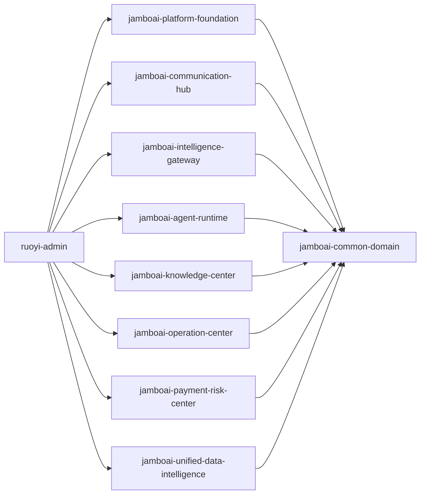

# JamboAI Module Boundaries

## Principles

- Keep RuoYi-Vue-Plus as the admin, tenant, auth and operations foundation.
- Keep JamboAI business code in `org.dromara.jamboai.*` packages and `jamboai-*` Maven modules.
- Use `tenant_id`, `agent_id`, `merchant_id` and `member_id` as the shared business scope.
- Communicate between domains with interfaces and Spring Events first. Replace Spring Event with MQ later without changing domain APIs.
- Treat LangChain4j as the model orchestration layer, not as the owner of prompts, tools, knowledge or memory.

## Dependency Direction

## Table Mapping

| Domain | Tables |
| --- | --- |
| Platform foundation | `biz_base_tenant_ext`, `biz_base_city_agent`, `biz_base_merchant`, `biz_base_merchant_staff`, `biz_base_merchant_role`, `biz_base_merchant_staff_role`, `biz_base_merchant_permission`, `biz_base_merchant_role_permission`, `biz_base_member`, `biz_base_merchant_member`, `biz_base_org_relation`, `biz_base_app_menu`, `biz_base_app_menu_i18n` |
| Communication hub | `biz_cmh_channel_account`, `biz_cmh_whatsapp_phone`, `biz_cmh_session`, `biz_cmh_message`, `biz_cmh_handover`, `biz_cmh_message_template` |
| Intelligence gateway | `ai_igw_model_provider`, `ai_igw_model_route`, `ai_igw_prompt_template`, `ai_igw_token_log`, `ai_igw_model_call_log` |
| Agent runtime | `ai_iar_capability`, `ai_iar_tool`, `ai_iar_agent_template`, `ai_iar_template_tool`, `ai_iar_agent_app`, `ai_iar_agent_app_tool`, `ai_iar_agent_knowledge`, `ai_iar_task`, `ai_iar_tool_call_log` |
| Knowledge center | `ai_knc_document`, `ai_knc_chunk`, `ai_knc_embedding`, `ai_knc_faq` |
| Operation center | `biz_opc_goods`, `biz_opc_goods_sku`, `biz_opc_order`, `biz_opc_order_item`, `biz_opc_order_flow`, `biz_opc_order_delivery`, `biz_opc_service`, `biz_opc_service_teacher`, `biz_opc_service_schedule_rule`, `biz_opc_service_schedule_slot`, `biz_opc_service_schedule_instance`, `biz_opc_service_entitlement`, `biz_opc_booking`, `biz_opc_booking_verify` |
| Payment and risk center | `biz_prc_platform_account`, `biz_prc_merchant_payment_account`, `biz_prc_payment_channel`, `biz_prc_wallet`, `biz_prc_wallet_ledger`, `biz_prc_payment_transaction`, `biz_prc_payment_callback_log`, `biz_prc_fee_rule`, `biz_prc_fee_ledger`, `biz_prc_commission_ledger`, `biz_prc_settlement`, `biz_prc_withdraw`, `biz_prc_reconciliation_bill`, `biz_prc_reconciliation_detail`, `biz_prc_risk_score`, `biz_prc_blacklist` |
| Unified data intelligence | `ai_udi_memory`, `ai_udi_feedback`, `ai_udi_metric`, `ai_udi_behavior` |
