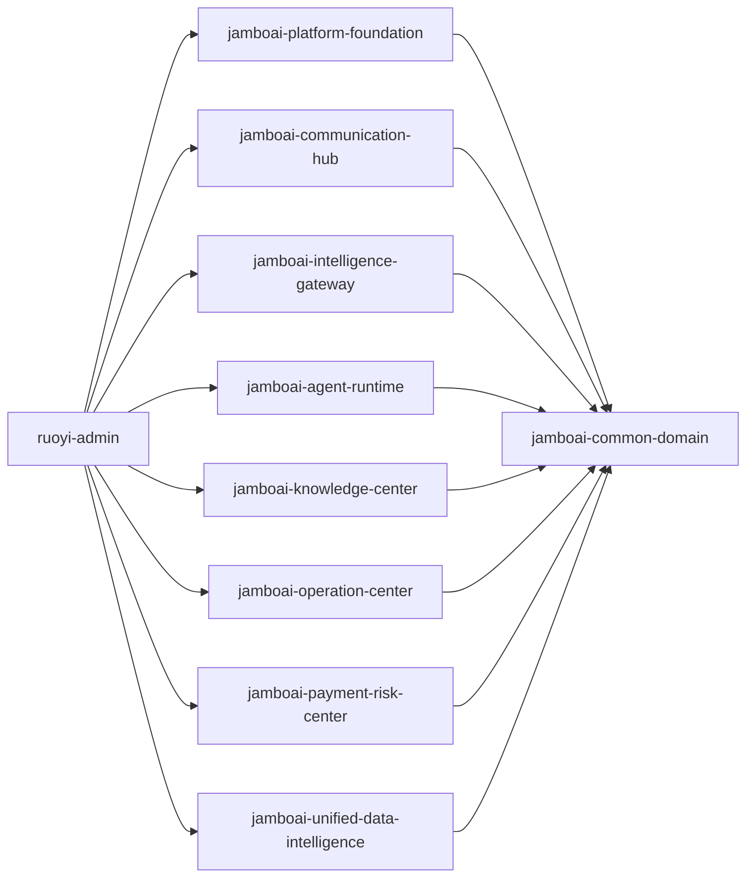

# JamboAI 模块边界

## 原则

- 保持 RuoYi-Vue-Plus 作为后台、租户、认证和运维基础。
- JamboAI 业务代码放在 `org.dromara.jamboai.*` 包和 `jamboai-*` Maven 模块中。
- 使用 `tenant_id`、`agent_id`、`merchant_id` 和 `member_id` 作为共享业务范围。
- 领域之间优先通过接口和 Spring Event 通信。后续替换为 MQ 时不改变领域 API。
- LangChain4j 是模型编排层，不拥有提示词、工具、知识库或记忆数据。
- 新增 JamboAI API 使用 `/api/sys/**`、`/api/mch/**`、`/api/usr/**`、`/api/pub/**` 和 `/api/whk/**`。

## 依赖方向

## 表映射

| 领域 | 表 |
| --- | --- |
| 平台基础 | `biz_base_tenant_ext`, `biz_base_city_agent`, `biz_base_merchant`, `biz_base_merchant_staff`, `biz_base_merchant_role`, `biz_base_merchant_staff_role`, `biz_base_merchant_permission`, `biz_base_merchant_role_permission`, `biz_base_member`, `biz_base_merchant_member`, `biz_base_org_relation`, `biz_base_app_menu`, `biz_base_app_menu_i18n` |
| 通信中心 | `biz_cmh_channel_account`, `biz_cmh_whatsapp_phone`, `biz_cmh_session`, `biz_cmh_message`, `biz_cmh_handover`, `biz_cmh_message_template` |
| 智能网关 | `ai_igw_model_provider`, `ai_igw_model_route`, `ai_igw_prompt_template`, `ai_igw_token_log`, `ai_igw_model_call_log` |
| Agent 运行时 | `ai_iar_capability`, `ai_iar_tool`, `ai_iar_agent_template`, `ai_iar_template_tool`, `ai_iar_agent_app`, `ai_iar_agent_app_tool`, `ai_iar_agent_knowledge`, `ai_iar_task`, `ai_iar_tool_call_log` |
| 知识中心 | `ai_knc_document`, `ai_knc_chunk`, `ai_knc_embedding`, `ai_knc_faq` |
| 运营中心 | `biz_opc_goods`, `biz_opc_goods_sku`, `biz_opc_order`, `biz_opc_order_item`, `biz_opc_order_flow`, `biz_opc_order_delivery`, `biz_opc_service`, `biz_opc_service_teacher`, `biz_opc_service_schedule_rule`, `biz_opc_service_schedule_slot`, `biz_opc_service_schedule_instance`, `biz_opc_service_entitlement`, `biz_opc_booking`, `biz_opc_booking_verify` |
| 支付与风控中心 | `biz_prc_platform_account`, `biz_prc_merchant_payment_account`, `biz_prc_payment_channel`, `biz_prc_wallet`, `biz_prc_wallet_ledger`, `biz_prc_payment_transaction`, `biz_prc_payment_callback_log`, `biz_prc_fee_rule`, `biz_prc_fee_ledger`, `biz_prc_commission_ledger`, `biz_prc_settlement`, `biz_prc_withdraw`, `biz_prc_reconciliation_bill`, `biz_prc_reconciliation_detail`, `biz_prc_risk_score`, `biz_prc_blacklist` |
| 统一数据智能 | `ai_udi_memory`, `ai_udi_feedback`, `ai_udi_metric`, `ai_udi_behavior` |
